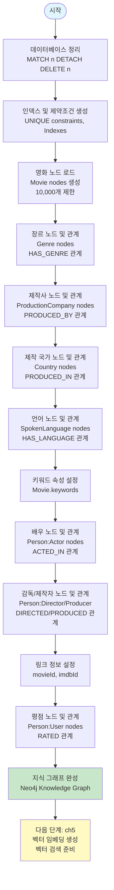
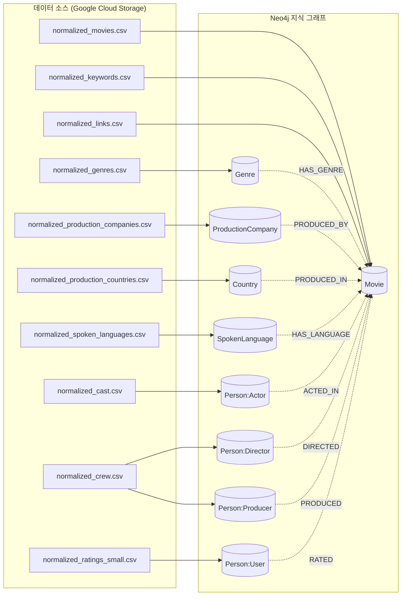
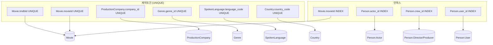
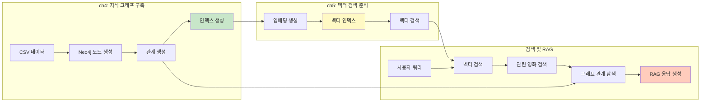
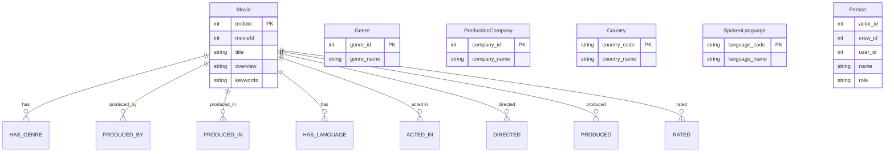

# Chapter 4: Knowledge Graph Building Flow

## 전체 프로세스 흐름

## 데이터 소스 및 로드 순서

## 인덱스 및 제약조건 구조

## RAG 및 검색 준비 관점

## 주요 노드 및 관계 타입

## 실행 순서 요약

1. **초기화**: 데이터베이스 정리 및 인덱스 생성
2. **핵심 노드**: Movie 노드 생성 (10,000개)
3. **속성 노드**: Genre, ProductionCompany, Country, SpokenLanguage
4. **키워드**: Movie 노드에 keywords 속성 추가
5. **인물 노드**: Actor, Director, Producer, User
6. **링크 정보**: movieId, imdbId 설정
7. **평점 데이터**: User와 Movie 간 RATED 관계

## ch5 연결점

- Movie 노드의 `overview` 속성 → ch5에서 벡터 임베딩 생성
- 생성된 벡터 인덱스 → 벡터 유사도 검색
- 그래프 관계 → RAG에서 컨텍스트 확장

