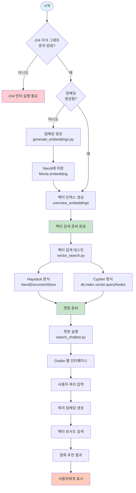
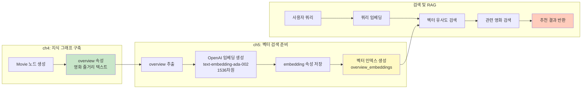
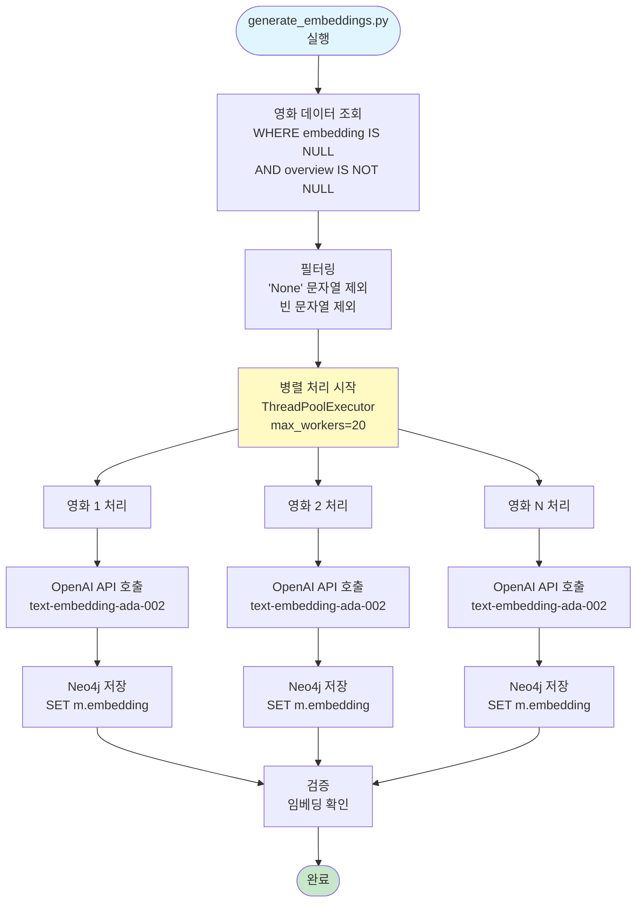
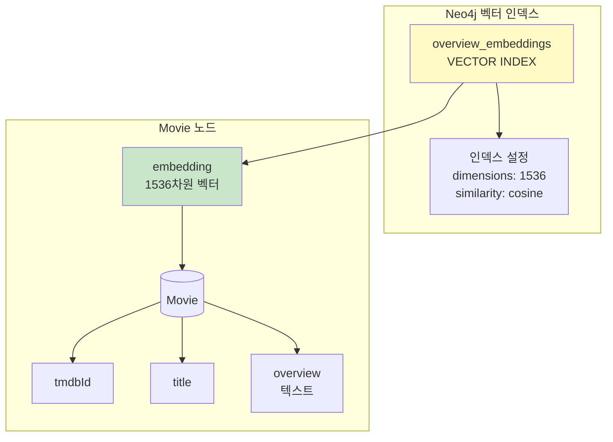
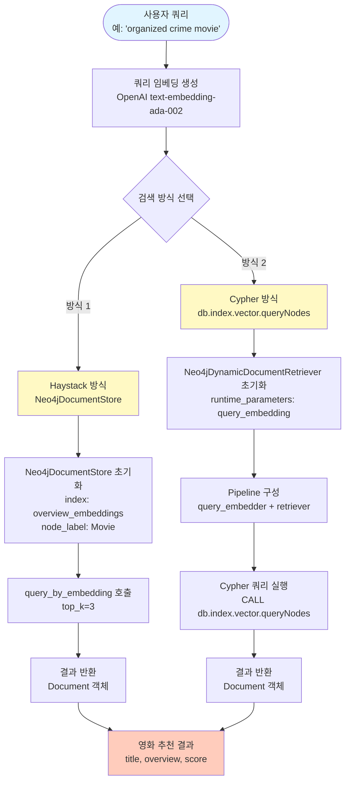
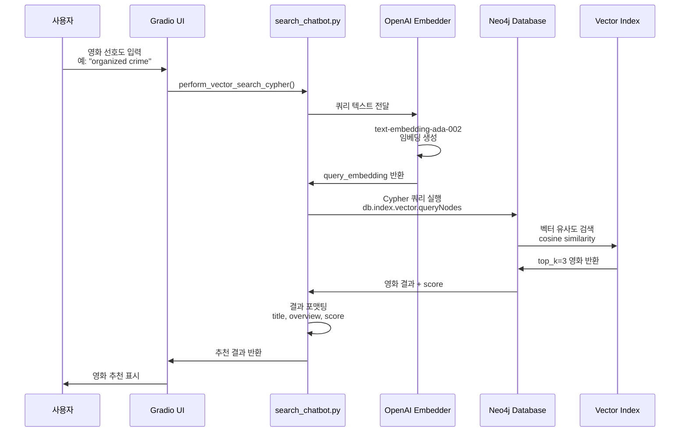
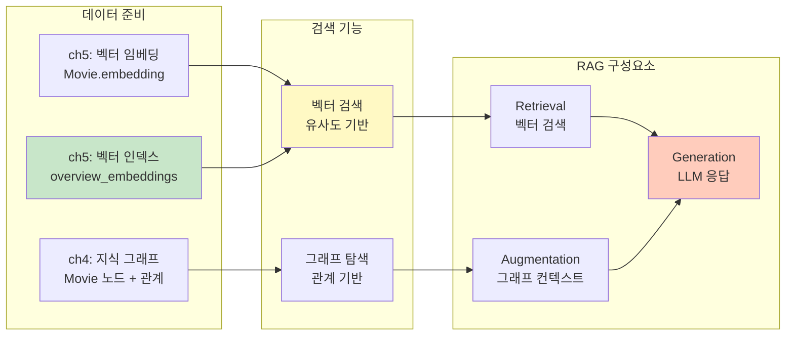
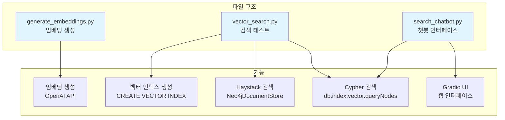

# Chapter 5: Vector Search and RAG Implementation Flow

## 전체 프로세스 흐름

## ch4에서 ch5로의 연결

## 임베딩 생성 프로세스

## 벡터 인덱스 구조

## 벡터 검색 방식 비교

## 챗봇 인터페이스 Flow

## RAG 파이프라인 준비 상태

## 주요 컴포넌트 및 파일

## 실행 순서 요약

1. **전제 조건 확인**: ch4에서 Movie 노드와 overview 속성이 준비되어 있어야 함
2. **임베딩 생성**: `generate_embeddings.py` 실행
   - Movie.overview에서 텍스트 추출
   - OpenAI API로 임베딩 생성 (1536차원)
   - Movie.embedding 속성에 저장
   - 병렬 처리로 효율성 향상
3. **벡터 인덱스 생성**: `vector_search.py` 실행 시 자동 생성
   - 인덱스명: `overview_embeddings`
   - 차원: 1536
   - 유사도 함수: cosine
4. **검색 테스트**: `vector_search.py`로 두 가지 방식 테스트
   - Haystack 방식: Neo4jDocumentStore 사용
   - Cypher 방식: db.index.vector.queryNodes 사용
5. **챗봇 실행**: `search_chatbot.py` 실행
   - Gradio 웹 인터페이스 시작
   - 사용자 쿼리 입력 받기
   - 벡터 검색 수행
   - 영화 추천 결과 반환

## 기술 스택

- **임베딩 모델**: OpenAI text-embedding-ada-002 (1536차원)
- **벡터 인덱스**: Neo4j Vector Index (cosine similarity)
- **검색 프레임워크**: Haystack (neo4j-haystack)
- **UI 프레임워크**: Gradio
- **데이터베이스**: Neo4j

## ch6 연결점 (예상)

- 벡터 검색 결과 → LLM 프롬프트에 통합
- 그래프 관계 탐색과 벡터 검색 결합
- RAG 파이프라인 완성

